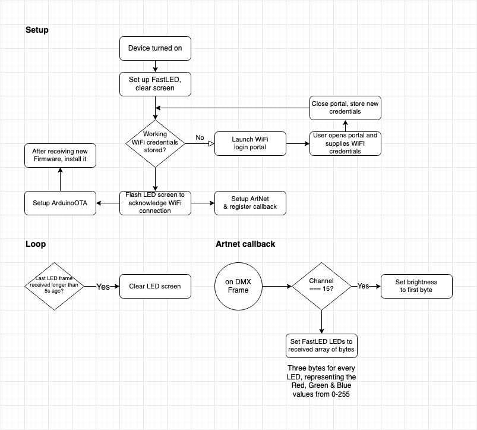

# Artnet FastLED Display + WiFi Manager + OTA-updater 

Combining the following libraries to create a FastLED grid display.

https://github.com/FastLED/FastLED
https://github.com/zhouhan0126/WIFIMANAGER-ESP32/blob/master/WiFiManager.cpp
https://github.com/rstephan/ArtnetWifi/
https://github.com/espressif/arduino-esp32/tree/master/libraries/ArduinoOTA
